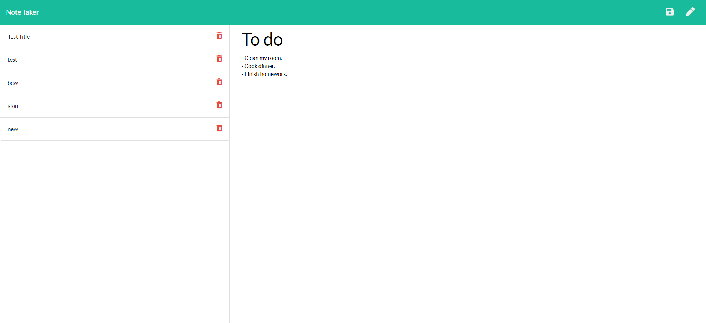

# Cool-Notes
## Description
Cool Notes is built with nodeJS and the express module to enable users to write notes and save !
live link at : https://cool-notes-taker.herokuapp.com/

## Table of Contents 
* [Installation](#installation)
* [Usage](#usage)
* [Tests](#tests)
* [Questions](#questions)
## Installation
To install necessary dependencies, run the following command:
```
npm i
```
## Usage
install all dependencies, run node server.js , and open the browser to start your notes

## Tests
To run tests, run the following command:
```
npm test
```
## Questions
If you have any questions about the repo, open an issue or contact me directly at nicollas@gmail.com. 
You can find more of my work at [nickverneck](https://github.com/nickverneck/).

